<p align="center">
  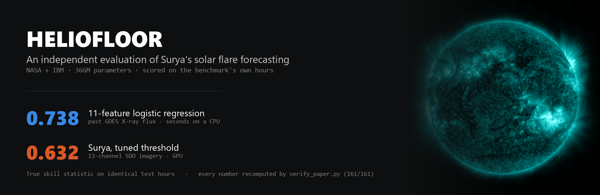
</p>

<p align="center">
  <a href="https://doi.org/10.22541/essoar.15008581/v1"></a>
  <a href="https://doi.org/10.5281/zenodo.22905499"></a>
  
  
  
</p>

---

Surya is the 366M-parameter heliophysics foundation model released by NASA and IBM in
August 2025. Its paper reports a solar flare forecasting score of **TSS 0.436** against two
deep image baselines. This repository holds, to our knowledge, the **first independent
evaluation** of the released `solar_flares_surya` checkpoint — together with the cheap
baselines the benchmark never reports.

The manuscript is a preprint on ESS Open Archive:
[doi:10.22541/essoar.15008581/v1](https://doi.org/10.22541/essoar.15008581/v1).
`paper.pdf` is the submitted version, `PAPER_DRAFT.md` the same text in Markdown, and
`PAPER_TR.md` a full Turkish translation.

## The result in one table

Matched comparison — the same forecast hours scored for every method.

| | validation (739 h) | test (407 h) | input | cost to train |
|---|---|---|---|---|
| **GOES-history logistic** | **0.685** | **0.738** | 7 days of X-ray flux | seconds, CPU |
| Surya, tuned threshold | 0.673 | 0.632 | 13-channel SDO imagery | pretrained, GPU |
| Surya, shipped 0.5 threshold | 0.425 | 0.173 | 13-channel SDO imagery | pretrained, GPU |
| 24-hour persistence | 0.405 | 0.618 | yesterday's X-ray flux | none |
| climatology ("never") | 0.000 | 0.000 | none | none |

True skill statistic. Thresholds are each method's full-sample optimum; the shipped 0.5 is
the model as released. **Every interval on these numbers is wider than the gaps between
them** — which is the point of the paper, not a footnote.

## What we did

We ran the released checkpoint with the authors' own inference code on **1,146 forecast
hours** sampled from 2011–2024 (218 positive), streaming 1,224 raw SDO netCDF files from
the official archive — roughly 700 GB. Because non-imagery baselines need no GPU, we also
scored them on the **complete** official splits: 3,672 validation and 43,848 test hours.

Every number in the manuscript is recomputed from the committed data by `verify_paper.py`,
which prints a pass/fail line per claim, including exact reproduction of every bootstrap
interval. It currently reports **161/161**.

<p align="center">
  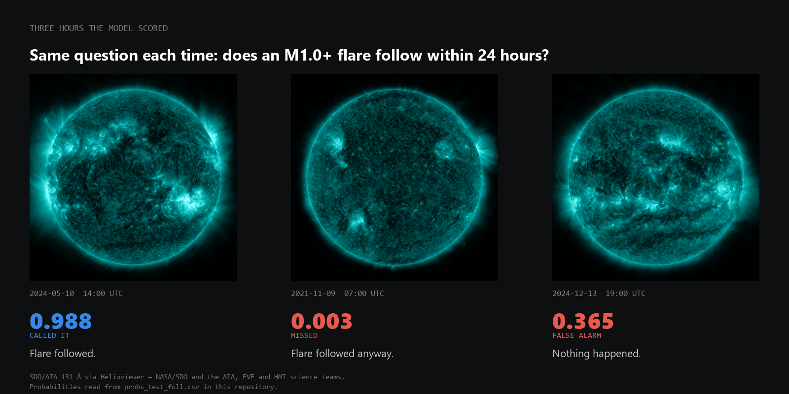
</p>

## Headline findings

**1. The benchmark's effective sample is far smaller than it appears.** Hours inside a
24-hour block are autocorrelated, so the block is the unit of evidence: 739 validation
hours occupy 50 blocks of which only **6 contain any positive**; 407 test hours occupy 28
blocks of which 11 do. Block-bootstrap 95% intervals are 0.46–0.81 TSS wide, paired
differences straddle zero for eight of ten method pairs, and no pair survives a ten-way
family-wise correction. The strongest separation is the shipped 0.5 threshold scoring
*below* persistence on test (ΔTSS −0.445).

<p align="center">
  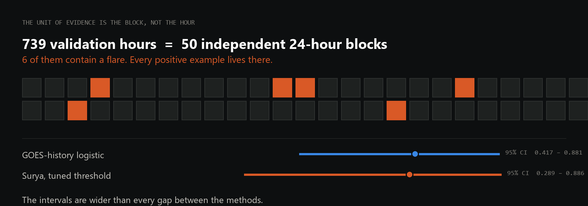
</p>

**2. Calibration is regime-dependent and does not transfer.**

<p align="center">
  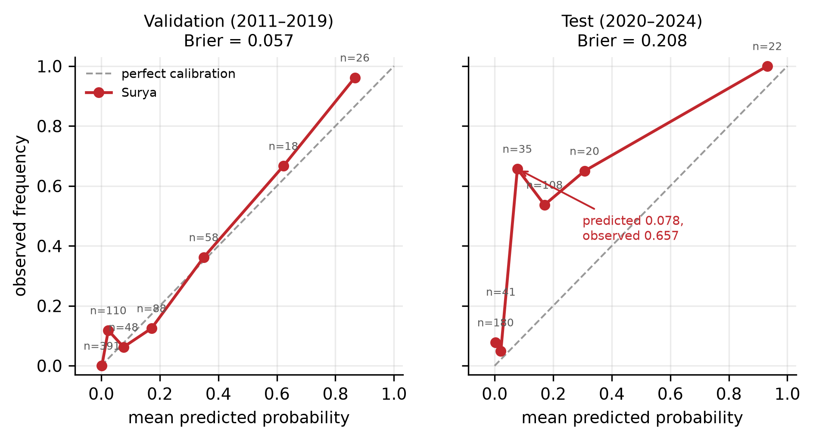
</p>

Brier 0.057 on validation against 0.208 on test. Test hours assigned 0.05–0.25 are followed
by a flare 56.6% of the time against a mean predicted 0.148. A Platt rescaling fitted on
validation is a near-identity map and changes nothing.

**3. A cheap non-imagery baseline matches or exceeds the model.** An 11-feature logistic
regression over past GOES X-ray flux — seconds to train on a CPU — ties Surya on identical
validation hours and beats it on identical test hours. On the complete splits it reaches
0.661 and 0.554.

**4. The benchmark reports no cheap baseline at all.** A 24-hour persistence rule reaches
TSS 0.430 on the full validation split, with a 95% interval of [0.238, 0.621] that contains
the reported 0.436.

<p align="center">
  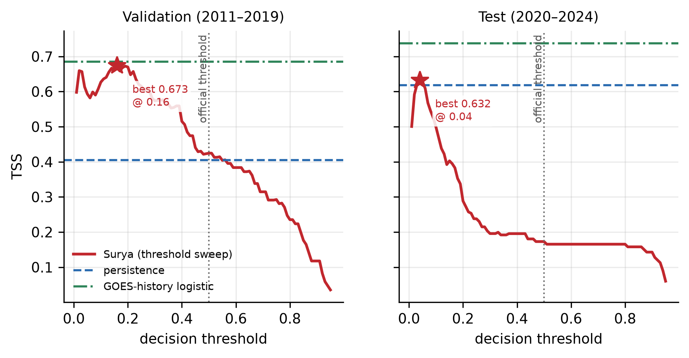
</p>

The shipped 0.5 threshold sits far from any optimum in both windows, which is why the
model's released configuration scores below a persistence rule on test.

**5. The ground moves under the test set.**

<p align="center">
  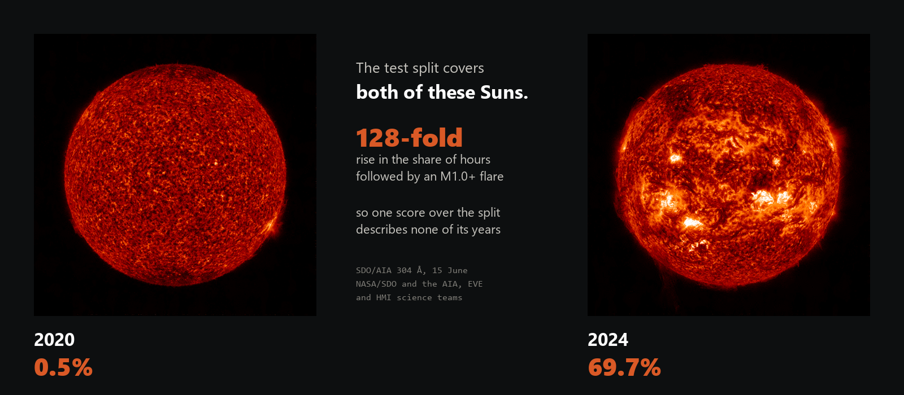
</p>

<p align="center">
  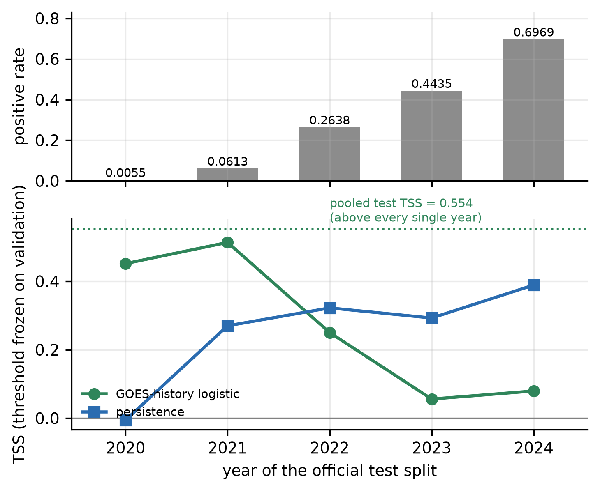
</p>

The positive rate in the official test split rises from 0.0055 (2020) to 0.697 (2024) —
**128-fold** — as solar cycle 25 climbs. Pooled test TSS (0.554) exceeds every per-year
value (0.056–0.514): a Simpson's paradox. This drift is the common cause behind findings 2
and 5.

**6. Skill appears regime-split, but only its structural half is estimable.**

<p align="center">
  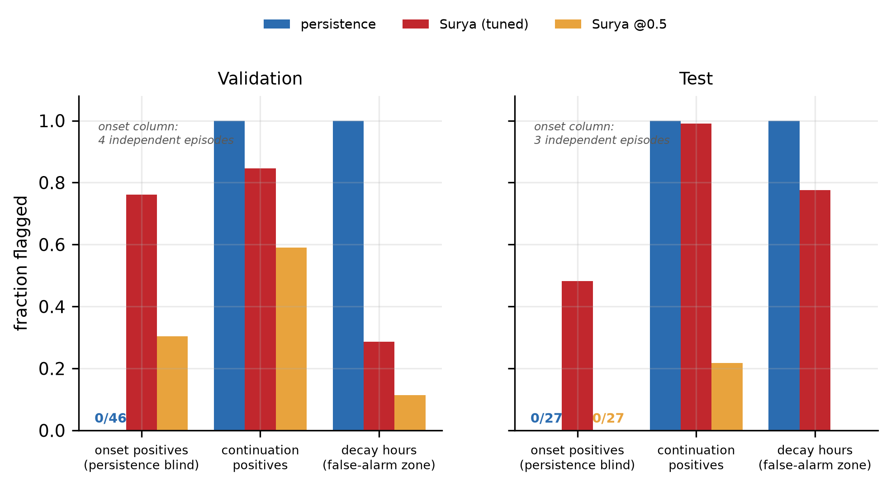
</p>

Persistence is definitionally blind to the onset of a flare episode and false-alarms on
every decay hour, so the two methods fail in different places. The model's onset behaviour,
however, rests on four (validation) and three (test) independent episodes, which supports
description but not estimation — we report it as an observation and quote no rate.

**What this does not claim.** Eight of the ten paired differences straddle zero, and
neither exclusion survives a family-wise correction. That is the finding rather than a
caveat: at 50 and 28 blocks the protocol resolves almost nothing, so these results show
that the benchmark cannot rank methods as published — not that any one method is better.

## The reported 0.436 cannot be located

<p align="center">
  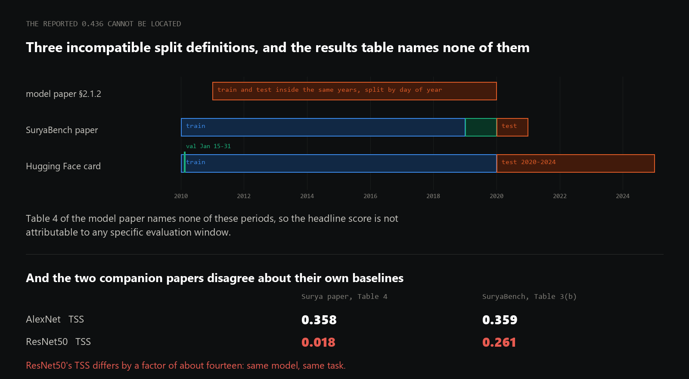
</p>

While verifying our own citations we found that the released artifacts give **three
mutually incompatible split definitions**, and Table 4 of the model paper names none of
them — so the headline score is not attributable to any specific evaluation period. Worse,
the two companion papers report irreconcilable numbers for the same baselines on the same
task: ResNet50's TSS is 0.018 in the Surya paper and 0.261 in SuryaBench, a factor of
fourteen. Details and sources in §2.3 of the manuscript.

## A leakage trap worth knowing about

<p align="center">
  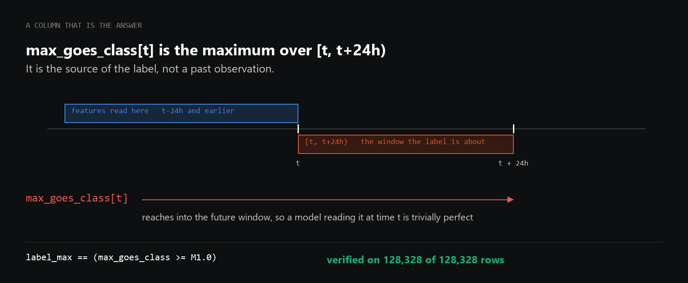
</p>

In the released flare CSVs, `max_goes_class[t]` is the maximum class over **[t, t+24h)** —
it is the *source of the label*, not a past observation. We verified
`label_max == (max_goes_class ≥ M1.0)` on **128,328 of 128,328 rows**. Any baseline reading
that column at time *t* is trivially perfect and meaningless. All features here are read at
t−24h or earlier.

This check also resolves a documentation conflict: SuryaBench's text states the threshold as
10⁻⁴ W m⁻² (X1.0) while calling it M1.0. The released labels follow M1.0 (10⁻⁵ W m⁻²).

## Reproducing

<p align="center">
  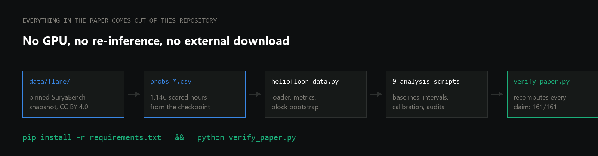
</p>

**Nothing needs downloading.** The scored probabilities are committed, and so is the exact
snapshot of the official SuryaBench flare CSVs the results were computed from
(`data/flare/`, 8.4 MB, CC BY 4.0 — see `data/flare/PROVENANCE.md` for the upstream
revision and checksums). No GPU, no re-inference and no external fetch are required.

```bash
python -m venv .venv && . .venv/bin/activate     # Windows: .venv\Scripts\activate
pip install -r requirements.txt

python verify_paper.py         # recomputes every manuscript claim, pass/fail per line
```

<details>
<summary>The individual analysis steps</summary>

```bash
python goes_baseline.py          # matched-hours baseline comparison    (CPU, ~1 min)
python full_split_baseline.py    # complete-split baselines             (CPU, ~5 min)
python analysis_pack.py          # bootstrap, calibration, regime split (CPU, ~2 min)
python block_support.py          # independent-block support per claim  (CPU, seconds)
python onset_ci.py               # onset catch-rate intervals           (CPU, ~1 min)
python paired_diff.py            # paired method differences            (CPU, ~4 min)
python gaps_audit.py             # multiplicity and block-length checks (CPU, ~3 min)
python audit_extra.py            # the quantities stated in prose       (CPU, ~1 min)
python precision_sensitivity.py  # bf16 worst-case bound                (CPU, ~1 min)
python make_figures.py           # writes figures/*.png|pdf
```

Building the PDF needs a LaTeX toolchain: `latexmk -pdf paper.tex`.

`heliofloor_colab.py` regenerates the probabilities from scratch (GPU + ~700 GB of streamed
SDO data); the block plan is deterministic from seed 42.
</details>

The data snapshot is pinned deliberately. Sections 2.3 and 2.4 document a label-leakage trap
and three incompatible split definitions in the released artifacts; if those are corrected
upstream, a reader running against corrected data would not reproduce our numbers and could
not tell why. Set `SURYABENCH_FLARE_DIR` to point at a different copy to check our results
against a newer revision.

## Files

| file | what it is |
|---|---|
| `paper.pdf` · `paper.tex` · `PAPER_DRAFT.md` · `PAPER_TR.md` | the manuscript, its source, Markdown and Turkish translation |
| `verify_paper.py` | recomputes every manuscript claim and prints pass/fail |
| `heliofloor_data.py` | **canonical loader, metrics, block bootstrap — imported by every script** |
| `goes_baseline.py` · `full_split_baseline.py` | the cheap baselines, on matched hours and on every official hour |
| `analysis_pack.py` · `block_support.py` · `onset_ci.py` · `paired_diff.py` | bootstrap, reliability, block support, onset rates, paired differences |
| `gaps_audit.py` · `precision_sensitivity.py` · `audit_extra.py` | self-attacks: label direction, multiplicity, bf16 bound, prose-level quantities |
| `plan_blocks.py` · `make_figures.py` · `heliofloor_colab.py` | seeded block sampler, figures, GPU inference runner |
| `probs_*.csv` | 1,146 scored hours: timestamp, label, model probability |
| `data/flare/` | pinned snapshot of the official SuryaBench flare CSVs (CC BY 4.0) with provenance |
| `outputs/` | committed output of every script, so numbers can be diffed without re-running |

## Data licensing

Code is Apache-2.0 (see `LICENSE`). Two things here are not ours and carry the CC BY 4.0
attribution requirement of the SuryaBench flare dataset
(`nasa-ibm-ai4science/surya-bench-flare-forecasting`, Roy et al. 2026): the label column in
`probs_*.csv`, and the redistributed snapshot in `data/flare/`, which is unmodified and
documented in `data/flare/PROVENANCE.md`. The model probabilities are our own output.

## Citing

Please cite the preprint (it has not been peer reviewed):

> Yıldırım, K. C. (2026). *An Independent Evaluation of Surya's Solar Flare Forecasting:
> Cheap Baselines Match a 366M-Parameter Foundation Model.* ESS Open Archive.
> https://doi.org/10.22541/essoar.15008581/v1

```bibtex
@misc{yildirim2026surya,
  author    = {Y{\i}ld{\i}r{\i}m, Kadir Can},
  title     = {An Independent Evaluation of Surya's Solar Flare Forecasting:
               Cheap Baselines Match a 366M-Parameter Foundation Model},
  year      = {2026},
  publisher = {ESS Open Archive},
  doi       = {10.22541/essoar.15008581/v1},
  url       = {https://doi.org/10.22541/essoar.15008581/v1},
  note      = {Preprint}
}
```

The archived release of this repository — code, scored probabilities and the pinned data
snapshot — has its own DOI:
[10.5281/zenodo.22905499](https://doi.org/10.5281/zenodo.22905499). `CITATION.cff` carries
the paper record, so GitHub's "Cite this repository" button produces it too.

## AI usage disclosure

Analysis code, experiment orchestration and draft prose were produced with assistance from
an AI coding assistant (Claude, Anthropic). Every reported number is computed by the
committed scripts from the committed data and is checked mechanically by `verify_paper.py`.
The label-leakage check, the split definitions, the bibliography and the comparison figures
quoted from the model paper were verified against primary sources by the author, who is
responsible for the content.
